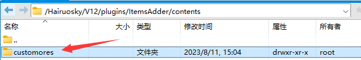

# IA文件夹解释

拿已经做好的来举例 （自定义新矿石 工具 护甲）

<figure><figcaption><p>自定义矿石</p></figcaption></figure>

这是我们自定义矿石以及对应物品的目录。这里存放着所有的配置文件

由于这是原创，强烈建议每次操作时先备份该目录

要不然GG就完蛋了

点开这个文件夹，可以看到下面两个子文件夹

其中 Config中存放着配置文件，textures存放着材质

<figure><figcaption><p>customores</p></figcaption></figure>

打开configs文件夹

<figure><figcaption><p>如图</p></figcaption></figure>

我们看到了五个YML文件

```
blocks.yml中储存着矿石方块和物品的配置文件，也就是下图的两个物品
```

<figure><figcaption></figcaption></figure>

```
helmet.yml中储存着对应盔甲的配置文件，也就是下图的四个物品
```

<figure><figcaption></figcaption></figure>

```
recipes.yml中储存着合成表配置文件，如下图
```

<figure><figcaption></figcaption></figure>

```
populators.yml中储存着方块的生成器。让方块能够正常在世界中生成
```

```
tools.yml中储存着工具的配置文件。如下图
```

<figure><figcaption></figcaption></figure>


接下来打开textures文件夹

<figure><figcaption></figcaption></figure>

block中储存着矿石方块的材质

ore储存着方块挖掘后对应的矿物的材质（也可以是矿石熔炼后等等的产物）

tools就是工具的材质
